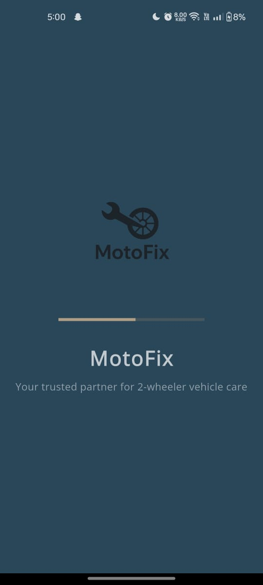
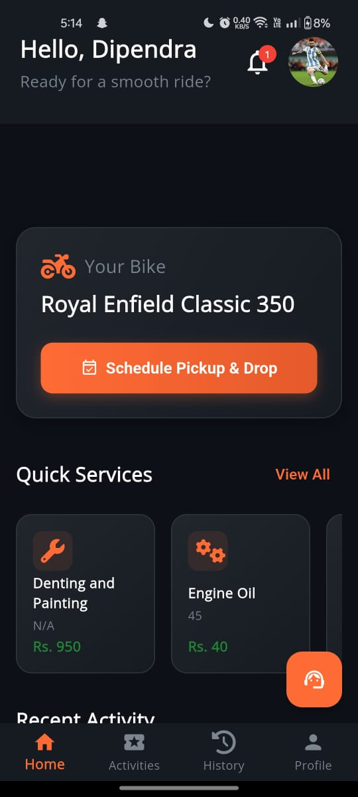
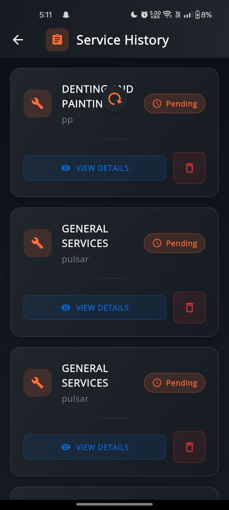
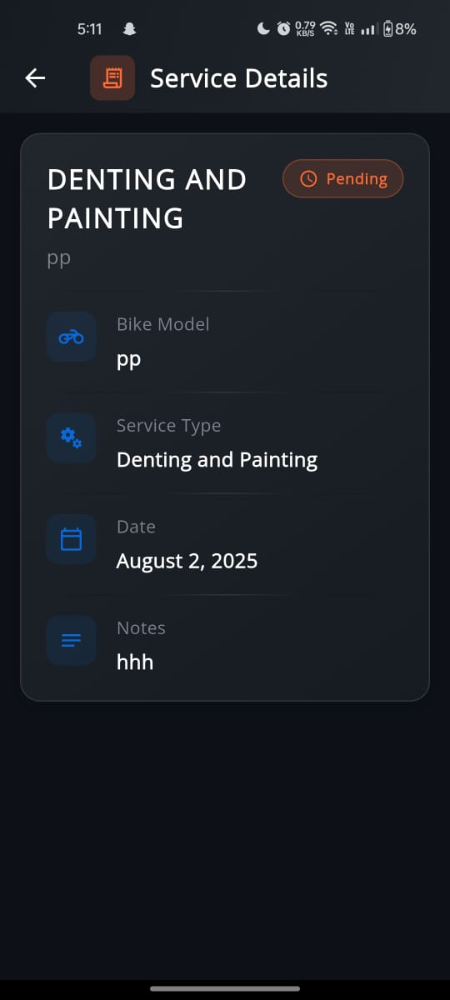
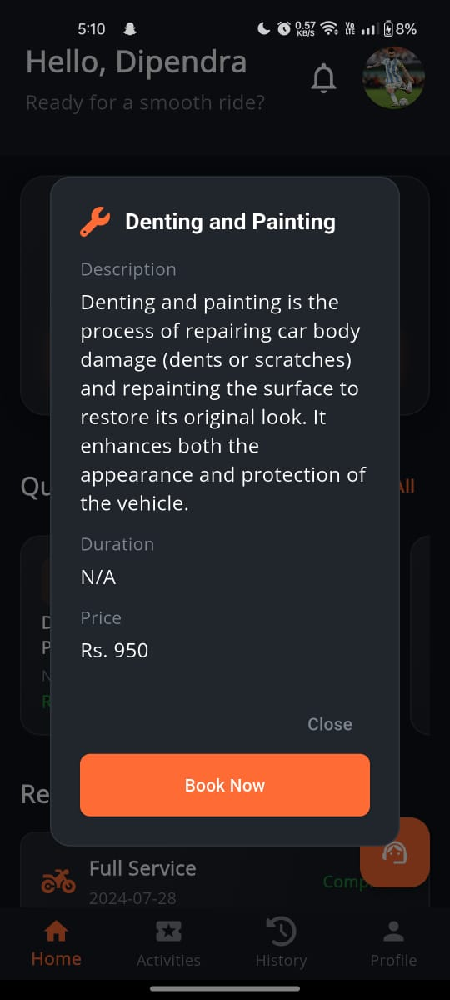
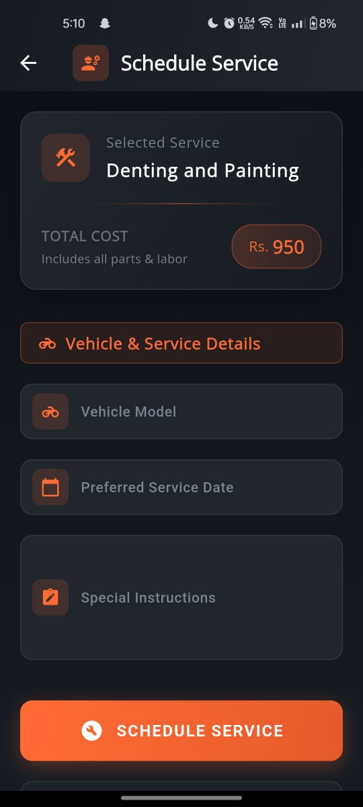
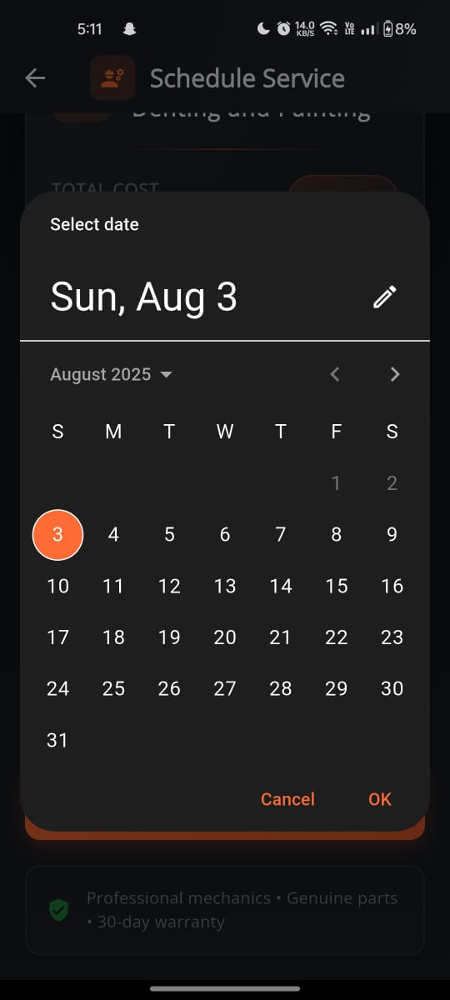
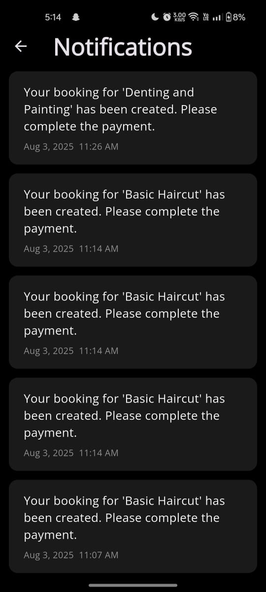

MotoFix: Motorcycle Service and Repair Platform
MotoFix is a comprehensive, full-stack platform designed to connect motorcycle owners with repair shops and mechanics. It provides a seamless experience for booking services, managing repairs, and handling communications through a modern web and mobile interface.

🛠️ Technology Stack
The project is built with a modern and robust technology stack:

Backend: Node.js, Express.js

Mobile (Android): Flutter

Database: MongoDB

API Testing: Postman 
## 📸 Screenshots

|  |  |
| --- | --- |
|  |  |
|  |  |
|  |  |
|  |  |
|  |  |
|  |  |

> All screenshots are stored in the `screenshot` folder of this repository.
